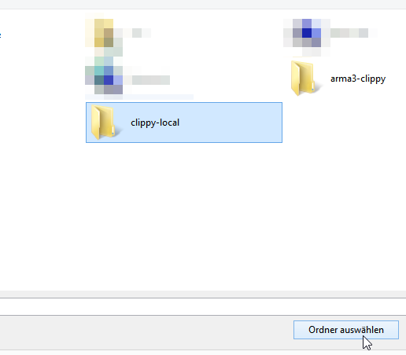

# Clippy for Arma 3

Hi! I'm Clippy, your personal battlefield-assistant! Find me in the [Steam Workshop](https://steamcommunity.com/sharedfiles/filedetails/?id=1876743064).

## How does it look in game?

Game masters can press Ctrl-Shift-C and enter up to 130 characters.

After they hit "Send", Clippy will happily pop up in every players screen to announce the good tidings.

## How to build the mod locally?

So you wanna build the mod for yourself so that you can implement your own awesome ideas for Clippy? Perfect.

### Preparations

_\* I assume you work with a Windows machine and clone the Repo on your Desktop, for simplicity._

Clone the repository: `git clone git@github.com:claudehohl/arma3-clippy.git`

Create a folder _clippy-local_ on your Desktop and create a folder named _addons_ inside that.

### Build

Open The Addon Builder in Arma Tools:

* Pick the _Clippy_-folder inside the repository as source directory
* Pick your newly created _addons_-folder as destination directory

Check the options:

* Set the "List of files to copy" to _\*.\*_
* Set "Addon prefix" to _A3_Clippy_

In the Addon Builder, hit _PACK_.

This has created _clippy-local\\addons\\Clippy.pbo_

### Load your local mod in Arma

In the Arma Launcher, click on _Local mod_:

Pick your _clippy-local_ folder:

The mod is installed. Load it!

...and everything is set to go.

## How to contribute

Fork this repository on GitHub and send [pull requests](https://help.github.com/en/articles/creating-a-pull-request-from-a-fork)!
